# Where is the best place to shoot on a Dartboard? - A statistical approach.

## Overview
In this project, we explore questions surrounding aiming at a dartboard. We explore how we can quantify how good an aiming spot is, and how it depends on your skill as a player. We investigate where is the best spot to actually shoot on a dartboard and in the process run into some very intersting mathematics, statistics and computer science concepts.

The non-triviality of this problem arises from the change in modelling of a darts player, from a perfect shooter to one which doesnt always hit where they aim but tends to get pretty close.


This tool could help players or even AI agents choose optimal strategies based on accuracey.

## Theoretical Model

We first let the dartboard be defined my specific curves on $\mathbb{R^2}$.

We assume that when a player shoots, they aim at a specific spot say $\bold{p} \in \mathbb{R^2}$.

Then we assume that where the dart lands is normally distributed around this point $\bold{p}$ with some standard deviation $\sigma$ whose value will depend on how good the player is. That is to say that, the position of landing $X(\bold{p}, \sigma) \sim N_2(\bold{p}, \sigma^2 I)$.

Now if we let $s: \mathbb{R^2} \rightarrow \mathbb{R}$ be the function which maps each spot on the dartboard (and outside it) to the amount of points awarded for landing there, we seek to investigate the random variable $$S(\bold{p}, \sigma) = s(X(\bold{p}, \sigma)).$$

## Expected Value under Theoretical Model

Let $R_1, R_2, ..., R_N$ be disjoint regions of $\mathbb{R^2}$ that each represent distinct sections of the dartboard (with one being the external region of the dartboard) with corresponding scores $v_1, v_2, ..., v_N$.

That is to say that for all $(x, y) \in R_i$, $s((x,y)) = v_i$.

Let $X(\bold{p}, \sigma)$ have pdf $f_X$.

Then the expected value has the form


$$
\begin{align*}
\mathbb{E}[S(\bold{p}, \sigma)] &= \mathbb{E}[s(X(\bold{p}, \sigma))]\\
  &= \iint\limits_\mathbb{R^2} s(x,y) \cdot f_X(x,y) \, dA\\
  &= \iint\limits_{\bigcup_{i=1}^{N} R_i} s(x,y) \cdot f_X(x,y) \, dA \\
  &= \sum_{i=1}^{N} \iint\limits_{R_i} s(x,y) \cdot f_X(x,y) \, dA \\
  &= \sum_{i=1}^{N} v_i \iint\limits_{R_i} f_X(x,y) \, dA \\
  &= \sum_{i=1}^{N} v_i \cdot P(\text{dart lands in }R_i).
\end{align*}
$$

This should hopefully be intuitive. If we have a 60%, 20% and 10% chance of being in the 10pt, 20pt and 40pt regions respecfively, the expected value should just be 10 * 0.6 + 20 * 0.2 + 40 * 0.1 = 14.

So this means that our problem simplifies does to computing the probability $P(R_i)$ of the dart landing in any given region $R_i$.

### Probability of Landing in a Given Region

Based on our assumption we have that $$f_X(\bold{x}) = \frac{1}{2 \pi \sigma^2} \exp\left( -\frac{|\bold{x} - \bold{p}|^2}{2\sigma^2} \right)$$

Then the probability the dart lands in our region $R$ is
$P(R) = \iint\limits_R f_X(x, y) \, dx\,dy$.

Now this will obviously not have a nice closed form. To get around this we will computationally approximate the $R$ with some polygon $\Gamma$. Then, $\Gamma$ is also the union of some finite amount of disjoint triangles $T_j$  Then we can write $\Gamma$ as $\bigcup_{j=1}^{k} T_j$.

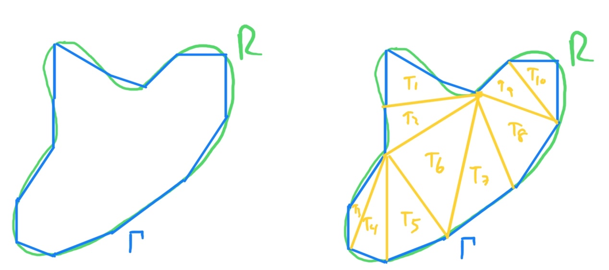

Figure 1: contour approximation of a curved region.

Then we can appriximate the probability of hitting a region by

$$
\begin{align*}
P(R) &= \iint\limits_R f_X(x, y) \, dx\,dy \\
  &\approx \iint\limits_\Gamma f_X(x, y) \, dx\,dy \\
  &= \iint\limits_{\bigcup_{j=1}^{k} T_j} f_X(x, y) \, dx\,dy \\
  &= \sum_{j=1}^{k} \iint\limits_{T_j} f_X(x, y) \, dx\,dy \\
  &= \sum_{j=1}^{k} P(\text{dart lands on triangle }T_j).
\end{align*}
$$

Then our problem becomes just trying to compute this integral over some generalised triangular domain T to compute the probability of the dart landing in it:

$I = \iint\limits_{T} \frac{1}{2 \pi \sigma^2} \exp\left( -\frac{|\bold{x} - \bold{p}|^2}{2\sigma^2} \right) \, dx\,dy$

### Probability of Hitting a Given Triangle
Let this triangle $T$ have vertices $\bold{t_1}, \bold{t_2}, \bold{t_3} \in \mathbb{R^2}$.

Now we want to find some linear transformation that maps $T$ to the standard triangle $Q = \{(0,0), (1,0), (1,1)\}$, so that we can do a change of variables.

So we are looking for some matrix $M \in \mathbb{M_{2,2}}$ and $\bold{b} \in \mathbb{R^2}$ such that

$W(\bold{x}) = M \bold{x} + \bold{b}$ has the properties:

- $W(\bold{t_1}) = (0,0)$
- $W(\bold{t_2}) = (1,0)$
- $W(\bold{t_3}) = (1,1)$

First note that whenever $M$ is not invertible, it is equivalent to saying the image of $Mx + b$ on $\mathbb{R^2}$ is a straight line. This only happens when the triangle $T$ is degenerate (with area 0) meaning that this integral will be 0 anways. So we will proceed assuming $M$ is invertible.

So
$$
\begin{align}
\begin{pmatrix} 0 \\ 0 \end{pmatrix} &= M \bold{t_1} + \bold{b} \\
\begin{pmatrix} 1 \\ 0 \end{pmatrix} &= M \bold{t_2} + \bold{b} \\
\begin{pmatrix} 1 \\ 1 \end{pmatrix} &= M \bold{t_3} + \bold{b}
\end{align}
$$

From (2) - (1) and (3) - (2), we get:
$$
\begin{align*}
\begin{pmatrix} 1 \\ 0 \end{pmatrix} &= M (\bold{t_2} - \bold{t_1}) \\
\begin{pmatrix} 0 \\ 1 \end{pmatrix} &= M (\bold{t_3} - \bold{t_2}) \\
\end{align*}
$$

and thus
$$
\begin{align*}
M^{-1}\begin{pmatrix} 1 \\ 0 \end{pmatrix} &= \bold{t_2} - \bold{t_1} \\
M^{-1}\begin{pmatrix} 0 \\ 1 \end{pmatrix} &= \bold{t_3} - \bold{t_2}. \\
\end{align*}
$$

Now
$$
\begin{align*}
    M^{-1} &= (M^{-1}\begin{pmatrix} 1 \\ 0 \end{pmatrix} | M^{-1}\begin{pmatrix} 0 \\ 1 \end{pmatrix}) \\
    &= (\bold{t_2} - \bold{t_1} | \bold{t_3} - \bold{t_2})
\end{align*}
$$

So $M = (\bold{t_2} - \bold{t_1} | \bold{t_3} - \bold{t_2})^{-1}$ and $\bold{b} = -M\bold{t_1}$.


Observe that $\bold{x} = M W^{-1}(\bold{x}) + b$ and so
$$
\begin{align*}
    W^{-1}(\bold{x}) &= M^{-1}(\bold{x} - \bold{b}) \\
    &= M^{-1}(\bold{x} + M\bold{t_1}) \\
    &= \bold{t_1} + M^{-1}\bold{x}.
\end{align*}
$$

This means that the jacobian $JW^{-1} = M^{-1} = (\bold{t_2} - \bold{t_1} | \bold{t_3} - \bold{t_2})$. Let $V = |\text{det}(JW^{-1})| = |\text{det}(\bold{t_2} - \bold{t_1} | \bold{t_3} - \bold{t_2})|$ which is some fixed constant.

Since $W$ maps $T$ to $Q$, and is injective, continuous and differentiable we can use the change of variables formula to get

$$
\begin{align*}
    I &= \iint\limits_{T} f_X(x,y) \, dx\,dy \\
    &= \iint\limits_{Q} f_X \circ W^{-1}(u,v) \cdot |\text{det}(JW^{-1})|\, dv\,du \\
    &= V \iint\limits_{Q} \frac{1}{2 \pi \sigma^2} \exp\left( -\frac{|W^{-1}(u, v) - \bold{p}|^2}{2\sigma^2} \right)\, dv\,du \\
    &= V \iint\limits_{Q} \frac{1}{2 \pi \sigma^2} \exp\left( -\frac{|\bold{t_1} + M^{-1}\begin{pmatrix} u \\ v \end{pmatrix} - \bold{p}|^2}{2\sigma^2} \right)\, dv\,du.
\end{align*}
$$

Then we can find constants $A, B, C, D, E, F$ such that $$\bold{t_1} + M^{-1}\begin{pmatrix} u \\ v \end{pmatrix} - \bold{p} = \begin{pmatrix} Au + Bv + C \\ Du + Ev + F \end{pmatrix}.$$

So we get

$$
\begin{align*}
    I &= \frac{V}{2 \pi \sigma^2} \iint\limits_{Q} \exp\left( -\frac{(Au+Bv+C)^2+(Du+Ev+F)^2}{2\sigma^2} \right)\, dv\,du.
\end{align*}
$$

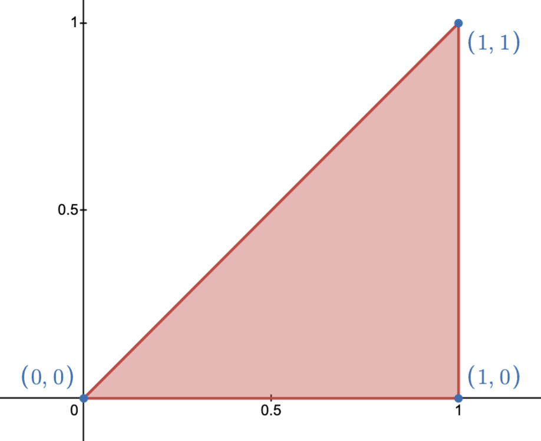
Also note that the region $Q$, pictured above, may be parametised as $0 \leq v \leq u$ and $0 \leq u \leq 1$. Thus we can write the integral as

$$I = \frac{V}{2 \pi \sigma^2} \int_{0}^{1} \int_{0}^{u}\exp\left( -\frac{(Au+Bv+C)^2+(Du+Ev+F)^2}{2\sigma^2} \right)\, dv\,du.$$

Now we seek to find constants $T, G, H, J, K, L$ such that $$(Au+Bv+C)^2+(Du+Ev+F)^2 = T(v + Gu + H)^2 + Ju^2 + Ku + L.$$

By equating coefficients of $u, v, u^2, v^2, uv, 1$ we get the following solutions to the system which allow us to computationally find these constants.

$$T = B^2 + E^2.$$
$$G = \frac{AB+DE}{T}.$$
$$H = \frac{BC+EF}{T}.$$
$$L = C^2 + F^2 - T H^2.$$
$$J = A^2 + D^2 - T G^2.$$
$$K = 2AC + 2DF - 2JGH.$$

Note that the formulas for $G$ and $H$ are not valid when $T=0$ but this wont matter as when $T = 0$ they dissapear from the equation anyways.

This gives us

$$
\begin{align*}
    I &= \frac{V}{2 \pi \sigma^2} \int_{0}^{1} \int_{0}^{u} \exp\left( -\frac{T(v + Gu + H)^2 + Ju^2 + Ku + L}{2\sigma^2} \right)\, dv\,du \\
    &= \frac{V}{2 \pi \sigma^2} \int_{0}^{1} \exp\left( -\frac{Ju^2 + Ku + L}{2\sigma^2} \right) \int_{0}^{u} \exp\left( -\frac{T(v + Gu + H)^2}{2\sigma^2} \right)\, dv\,du \\
    &= \frac{V}{2 \pi \sigma^2} \int_{0}^{1} \exp\left( -\frac{Ju^2 + Ku + L}{2\sigma^2} \right) \int_{Gu + H}^{u + Gu + H} \exp\left( -\frac{Tv_1^2}{2\sigma^2} \right)\, dv_1\,du\\
    &= \frac{V}{2 \pi \sigma^2} \int_{0}^{1} \exp\left( -\frac{Ju^2 + Ku + L}{2\sigma^2} \right) \int_{\frac{\sqrt{T}}{\sqrt{2} \sigma}(Gu + H)}^{\frac{\sqrt{T}}{\sqrt{2} \sigma}(u + Gu + H)} \frac{\sqrt{2} \sigma}{\sqrt{T}} \exp\left( -v_2^2 \right)\, dv_2\,du\\
    &= \frac{V}{2 \pi \sigma^2} \cdot \frac{\sqrt{2} \sigma}{\sqrt{T}} \cdot \frac{\sqrt{\pi}}{2}  \int_{0}^{1} \exp\left( -\frac{Ju^2 + Ku + L}{2\sigma^2} \right) \int_{\frac{\sqrt{T}}{\sqrt{2} \sigma}(Gu + H)}^{\frac{\sqrt{T}}{\sqrt{2} \sigma}(u + Gu + H)} \frac{2}{\sqrt{\pi}} \exp\left( -v_2^2 \right)\, dv_2\,du.
\end{align*}
$$

Then we appeal to the $\text{erf}$ function which has definition $$\text{erf}(z) = \frac{2}{\sqrt{\pi}}\int_{0}^{z} \exp\left( -t^2 \right)\, dt.$$

This gives us that
$$I = \frac{V}{2 \sqrt{2} \sqrt{\pi} \sqrt{T} \sigma} \int_{0}^{1} \exp\left( -\frac{Ju^2 + Ku + L}{2\sigma^2} \right) \left( \text{erf}(\frac{\sqrt{T}}{\sqrt{2} \sigma}(u + Gu + H)) - \text{erf}(\frac{\sqrt{T}}{\sqrt{2} \sigma}(Gu + H)) \right)\, du.$$

This final expression can then be put into a numerical integrator for evalutaiton.

### Putting it Together
The results of each triangle can then be passed back up to compute the probability of landing on a given region $R_i$

$$P(R_i) \approx \sum_{j=1}^{k} P(\text{dart lands on triangle }T_j).$$


and processed to compute the value of $P(R_i)$, the probability of landing on a given region $R$.

Finally we can get
$$
\begin{align*}
\mathbb{E}[S(\bold{p}, \sigma)] &= \sum_{i=1}^{N} v_i \cdot P(R_i).\\
\end{align*}
$$

## Implementation of Model
### Parametrising Board
The file `approximate_regions.py` does the job of parametrising each region. We copmute a sequence of points along the contour of each region (going counterclockwise) based on a given number of points per mm (on the contour). More points along the contour will lead to a slower response in future computations but will give a more precise value. This allows each region to be approximated by an arbitrarily accurate polygon.
Note that for the outer bull region, because it has a hole in it (and this somewhat complicates the next algorithm), we split this up into the left and right half so that each are complete.

The file `approximate_regions.py` will be given a directory to put the contours on. Within this directory, there will be the files `*.points` for each region. Each file e.g `double_1.points` will have the x and y coordinates (in mm assuming the center of the board is the origin) as space separated pairs on each line.

### Turning Polgons into Triangles - Ear Clipping Algorithm
In the `get_triangles.cpp` file we implemented the ear clipping algorithm which transforms the polygons into a sequence of triangles. This was informed by the paper '[Triangulation by Ear Clipping](https://www.geometrictools.com/Documentation/TriangulationByEarClipping.pdf)' by David Eberly. Directed my command line arguments, the file will take in a `*.points` file (discussed above) and will output the traingles to an outfile `*.triangles`. Each line represents one triangle, written as three vertices separated by "|" characters: "x1 y1|x2 y2|x3 y3".

We start with a polygon which may or may not be convex, but is guaranteed to be filled in. Assume that the vertices $v_1, v_2, ..., v_k$ are ordered anticlockwise.

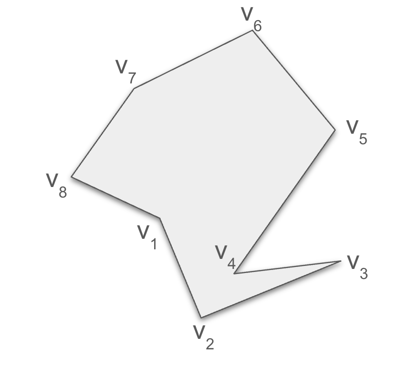
Figure 2: An example of a labelled polygon.

We start with defining _Ear_ vertex.
We say that $v_i$ is an ear vertex if and only if the following 2 conditions apply:

1. $v_i$ together with its neighbours $v_{i-1}$ and $v_{i+1}$ form a convex vertex (i.e the interior angle is less than $180^\circ$).

2. No other vertices in the triangle lie within the triangle formed by $v_{i-1}, v_i$ and $v_{i+1}$. Note that $v_2$ is an example of a vertex which is convex but not an ear since $v_4$ lies inside the triangle formed by $v_1, v_2$ and $v_3$.

An important theorem proved by G.H. Meisters is that all "A polygon of four or more sides always has at least two nonoverlapping ears". So the algorithm proceeds to sequentially remove ears until the polygon is decomposed into triangles. A naive implementation of this algorithm yeilds an $O(n^3)$ algorithm where $n$ is the number of vertices however with clever use of data structures we can write an $O(n^2)$ algorithm.

Note that we can efficiently tell is a vertex $v_i$ with neighbours $v_{i-1}, v_{i+1}$ is convex based on the sign of the cross product between the vectors $\overrightarrow{v_{i-1} v_{i}}$ and $\overrightarrow{v_i v_{i+1}}$. Furthermore we can efficiently check if the point $d$ is in the traingle $\Delta abc$ by checking that the areas of $\Delta ab,d$, $\Delta bcd$ and $\Delta acd$ sum to the area of $\Delta abc$.

To do the algorithm we maintain the following data structures:

1. A doubly linked list representing the current vertices in the polygon (with their adjacency in the list representing their adjacency in the polygon). This can be implemented using two arrays (next_v and prev_v) that store the indices of the next and previous vertices.

2. A set of current convex vertices.

3. A set of current reflex vertices.

4. A set of current ear vertices.

Note that the set of reflex and convex vertices are disjoint, while the set of ear vertices is a subset of the set of convex vertices.

We start the algorithm by computing the starting states of each of these data structures.

Following this we start repeatedly removing $Ear$ vertices from the triangle, ensuring to update the state of surrounding vertices. Note that during this process we take advantage of the following observations:

- When removing an ear, if its adjacent vertex was convex it will remain convex. However if its adjacent vertex was reflex it _might_ become convex.

- If some vertex $w$ distrupts a convex vertex $v$ from being an ear (i.e it lies inside the triangle at $v$, like $v_4$ and $v_2$ in figure X), $w$ is guaranteed to be a reflex vertex.

- If a vertex was an ear, removing any other ear will keep it as an ear.

By repeating the process of removing ears, saving the formed triangle and updating states, we succesfully decompose the polygon into triangles.

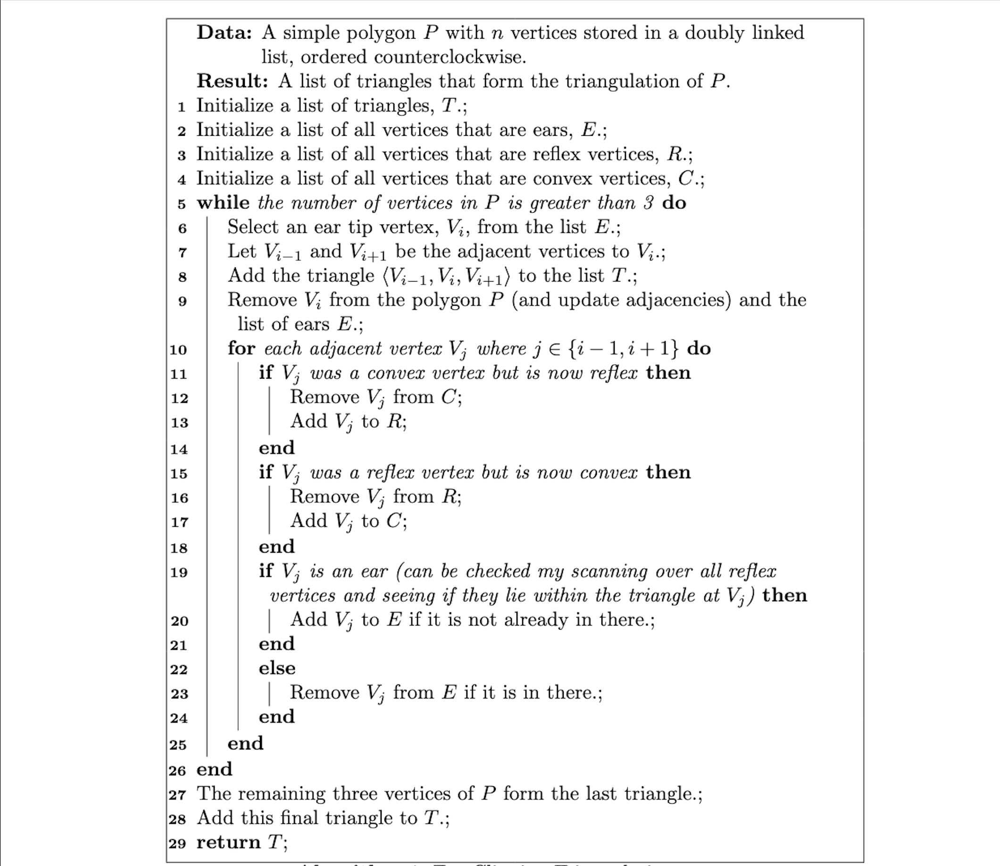
Pseudocode for the ear clipping algorithm.


### Computing Integrations

In the file `integrate_triangle` we implement the logic for computing the integral discussed above. The function is given the point of aim (p), the standard deviation and the 3 points of the triangle. It then follows the above discussed formulas to create the appropriate integrand. Then we use the scipy.integrate.quad function to compute the integral. The file `expected_value.py`, is a helper file which combines the integrals for different triangles within a given region and then sums the values over all given regions.


# Verifying Model using Monte Carlo Simulation
In the files `montecarlo_helpers.py` and `monte_carlo_verification.ipynb` we executed monte carlo simulations to test the validity of the theoretical model.

Over a range of different aiming positions and standard deviations, we simulated the throws based on the normal model proposed and measured the running average of the scores, to see how well it compared to the theoretically computed expected values.

The theoretical model prediciton was made based of contours generated with 5 points per mm.

Below are the covergence plots for aiming at the bullseye, the triple 20 and the inner 10, over different standard deviations.

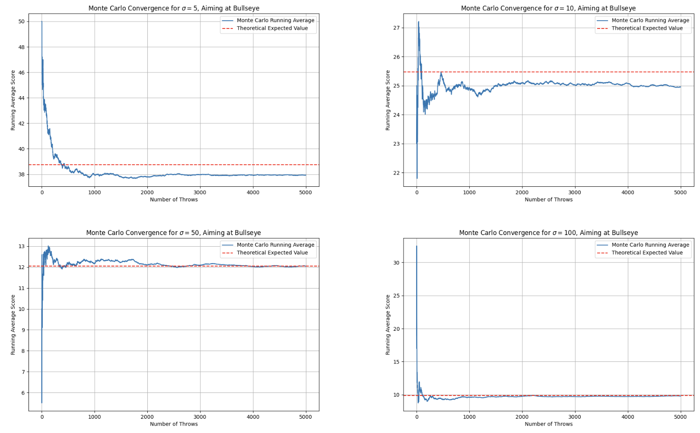
Figure 3: Running average score vs theoretical expected value for bullseye

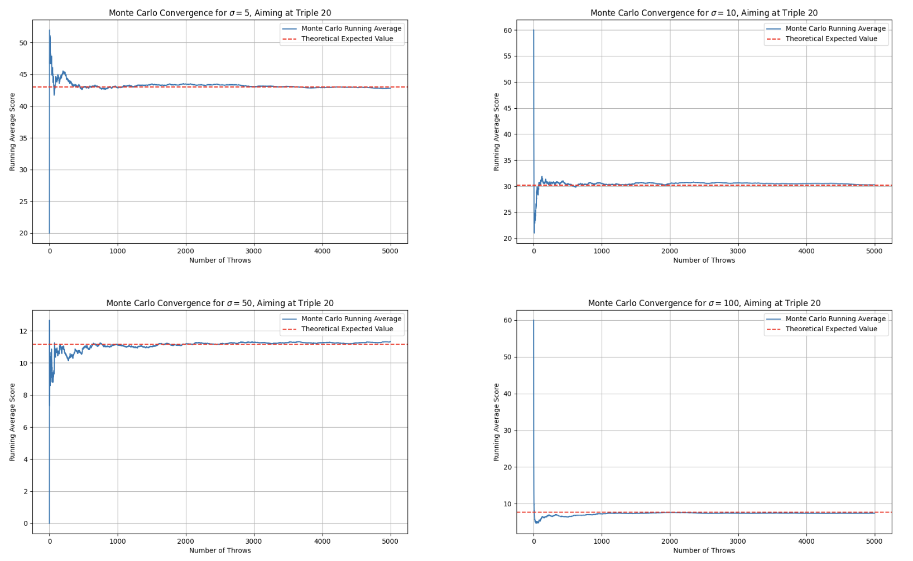
Figure 4: Running average score vs theoretical expected value for triple 20

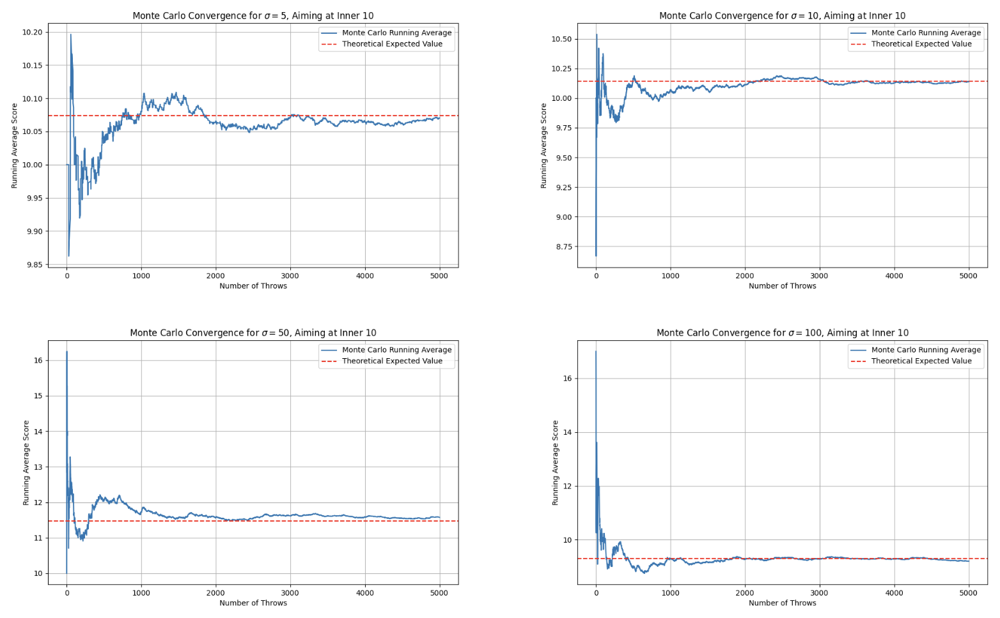
Figure 5: Running average score vs theoretical expected value for inner 10


We observe that the theoretical expected values are very accurate over most of the positions and standard deviaitons. It was particularly bad for the small values of standard deviation aiming at the bullseye. Not sure why this is the case.

Another experiment conducted to verify the model was to select 100 random aim points and standard deviations. At each of these we computed the average score after 2000 shots and compared this to the theoretical expected value.

This resulted in a Mean Absolute Error of 0.1682 which corresponded to a Normalised Mean Absolute error of 1.64% overall. This leads us to conclude that the model is accurate.

# Results
## Heatmap Plots
In the file `grid_plots.ipynb`, using the functions defined in `grid_plots.py`, we computed the expected value over different standard deviations on a grid aound the dartboard. The regions were estimated with contours which had 5 points per mm.

To speed up the process, we took advantage of multithreading, separating the work of computing the grid to different CPU's.

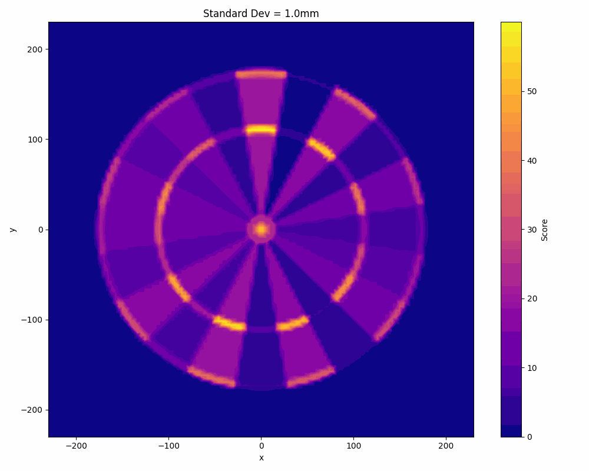

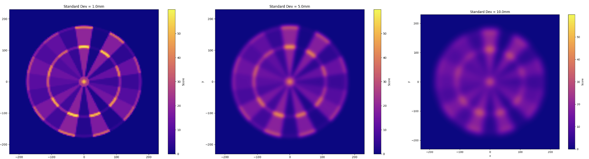
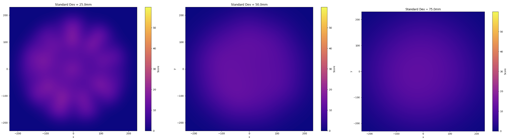
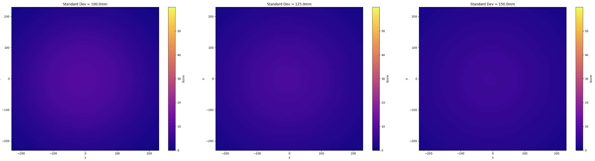
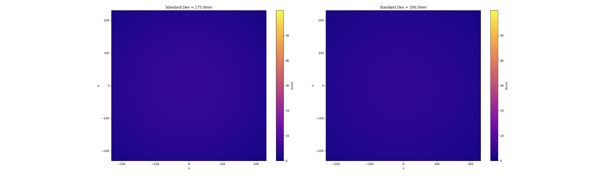

Figure 6: The expected value of aiming at different points on the dartboard over different standard deviations.

We can see that once you get to around 100mm standard deviation in your shooting it doesnt really matter where you aim. In the case of 100mm standard deviation, the expected value is around 9 points no matter where you aim.

Below we show a "normalised" version of the same gif, to highlight the bright spots. Observe that the scale bar changes as the standard deviaion changes.
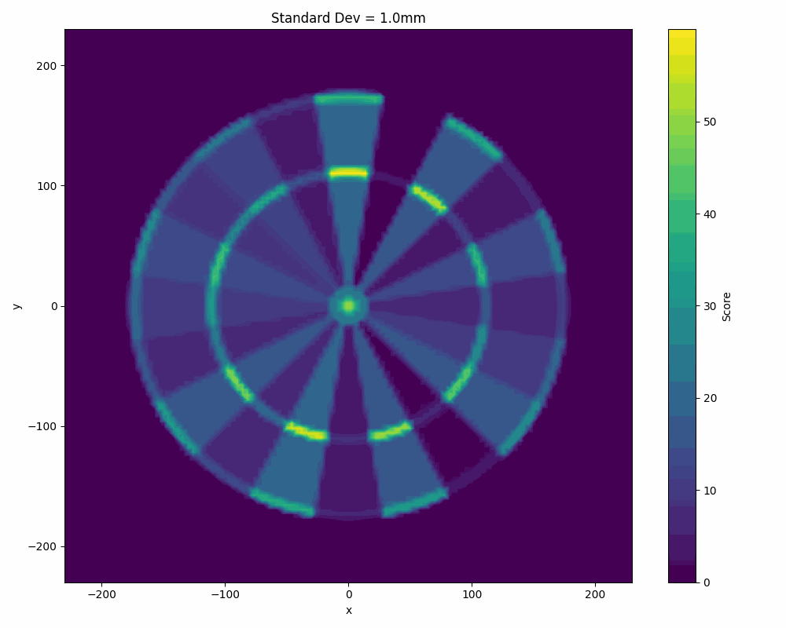


## Bullseye vs Triple-20
For this experiment, in file `bullseye_vs_triple_20.ipynb`, we created contours on the board with 1 points per mm, and then created triangles around this. We computed the expected score you get from aiming at the very middle of the board compared to the very center of the triple 20 (the highest value region on the board).

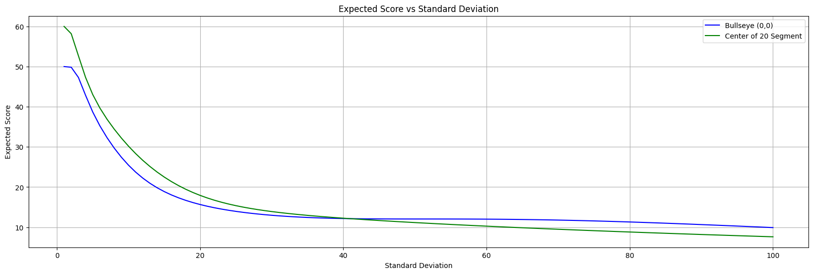
Figure 7: A plot of the expected score of aiming at the triple 20 and the bullseye over different standard deviations of the shot.

This reveals that if the standard deviation of your shot is less than 40.9mm you should aim for the triple 20 and if it is more than this, it is preferable to aim for the bullseye.

# How do I measure my $\sigma$?

Lets assume that you went to a dartboard and aimed directly at the center bullseye. We will aim to find your true value of $\sigma$ using the maximum likelihood estimator method.

Suppose that we took $n$ separate shots independantly $(X_1, Y_1), (X_2, Y_2), ..., (X_n, Y_n) \sim_\text{iid} N_2(\bold{p}, \sigma^2 I)$ (i.e independant and identically distributed).

The likelihood function for $\sigma$ based on these throws is given by

$$
\begin{align*}
L(\sigma) &= \prod_{i=1}^{n} f_{\sigma}(X_i, Y_i) \text{ where $f_{\sigma}$ is the pdf,}\\
  &= \prod_{i=1}^{n} \frac{1}{2 \pi \sigma^2} \exp \left( - \frac{|\begin{pmatrix} X_i \\ Y_i \end{pmatrix} - \begin{pmatrix} 0 \\ 0 \end{pmatrix}|}{2 \sigma^2} \right)\\
  &= \prod_{i=1}^{n} \frac{1}{2 \pi \sigma^2} \exp \left( - \frac{X_i^2 + Y_i^2}{2 \sigma^2} \right).
\end{align*}
$$

We seek to find a value of $\sigma$ that maximises this expression. Note that maximising this is equivalent to maximising the log likelihood $l(\sigma)$ which is given by

$$
\begin{align*}
l(\sigma) &= \log \left( \prod_{i=1}^{n} \frac{1}{2 \pi \sigma^2} \exp \left( - \frac{X_i^2 + Y_i^2}{2 \sigma^2} \right)\right)\\
&= \sum_{i=1}^n \log \left( \frac{1}{2 \pi \sigma^2} \exp \left( - \frac{X_i^2 + Y_i^2}{2 \sigma^2} \right)\right)\\
&= \sum_{i=1}^n \left(-\frac{X_i^2+Y_i^2}{2 \sigma^2} - \log \left(2 \pi \sigma^2 \right) \right).
\end{align*}
$$

Then taking the derivative of this expression with respect to $\sigma$ to find the maximum we get
$$
\begin{align*}
\frac{d}{dx}l(\sigma) &= \sum_{i=1}^n \left(-\frac{X_i^2+Y_i^2}{\sigma^3} - \frac{2}{\sigma} \right) \\
&= \frac{2n}{\sigma} - \frac{1}{\sigma^3}\sum_{i=1}^n (X_i^2 + Y_i^2).
\end{align*}
$$

Then setting $\frac{d}{dx}l(\sigma) = 0$ we obtain

$$
\begin{align*}
\sigma_{MLE} &= \sqrt{\frac{1}{2n} \sum_{i=1}^n (X_i^2 + Y_i^2)} \\
&= \sqrt{\frac{1}{2n} \sum_{i=1}^n D_i^2} \text{ }\\
\end{align*}
$$

where $D_i$ is the distance of the $i$'th throw from the center.

Thus we can conclude that this is our maximum likelihood estimator.

So to summarize, if one wanted to find what $\sigma$ they where throwing with, they would simply need to aim at the center of the board, throw $n$ shots, measuring the distance from the center $D_i$ of each throw. Then finally compute the above expression.


## Requirements

- Python 3.8+
- C++17 compatible compiler (g++ or clang++)
- Python packages: `numpy`, `scipy`, `matplotlib`, `pandas`, `opencv-python`

Install Python dependencies:
```bash
pip install numpy scipy matplotlib pandas opencv-python
```

## Pipeline

The computation pipeline has three stages that must be run in order:

### 1. Generate Region Contours

First, approximate each dartboard region with a polygon by generating points along its contour.

```python
import approximate_regions

# Generate contours with 5 points per mm (higher = more accurate but slower)
contours_dir = approximate_regions.output_all_contours(points_per_mm=5)
# Output: output/region_contours/points_per_mm=5/*.points
```

### 2. Triangulate the Polygons

Compile and run the C++ ear-clipping triangulation on each `.points` file.

```bash
# Compile the triangulation program
g++ get_triangles.cpp -std=c++17 -o get_triangles

# Run on all .points files in a directory
for f in output/region_contours/points_per_mm=5/*.points; do
    ./get_triangles "$f" "output/triangles/points_per_mm=5/$(basename "${f%.points}.triangles")"
done
```

### 3. Compute Expected Values

With the triangles generated, you can now compute expected scores for any aim point and skill level.

```python
import expected_value

# Compute expected score for aiming at (0, 0) with sigma=20mm
exp_val = expected_value.expected_value(
    triangles_dir='output/triangles/points_per_mm=5',
    p=(0, 0),
    std_dev=20
)
print(f"Expected value: {exp_val}")
```

### Running the Notebooks

The Jupyter notebooks provide interactive examples:
- `bullseye_vs_triple_20.ipynb` - Compare aiming strategies
- `grid_plots.ipynb` - Generate heatmaps of expected values
- `monte_carlo_verification.ipynb` - Validate the model with simulation

